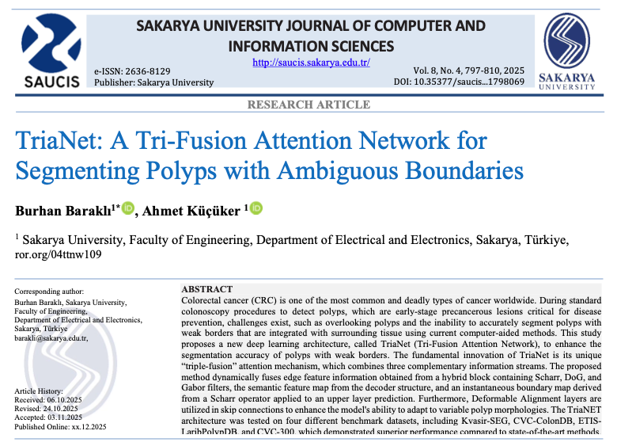
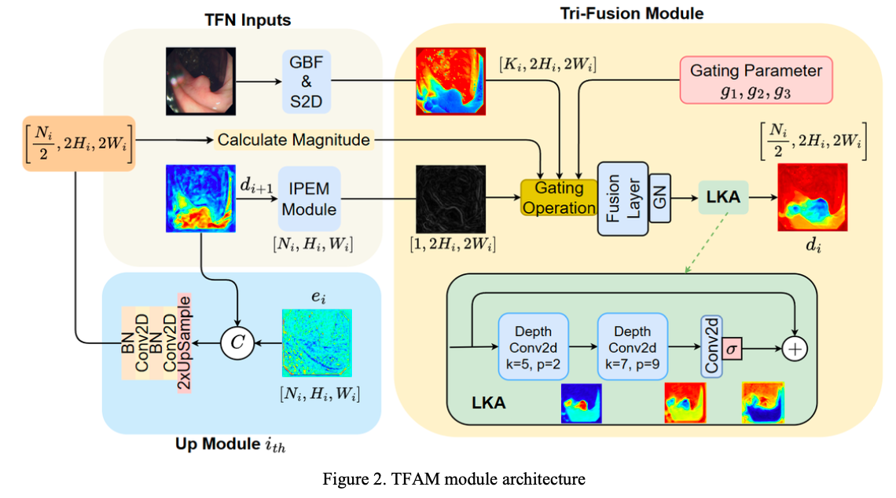
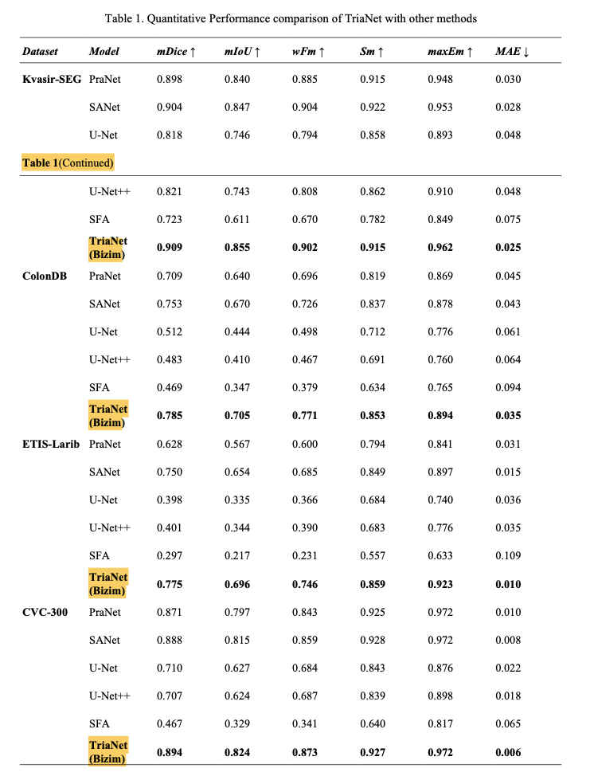
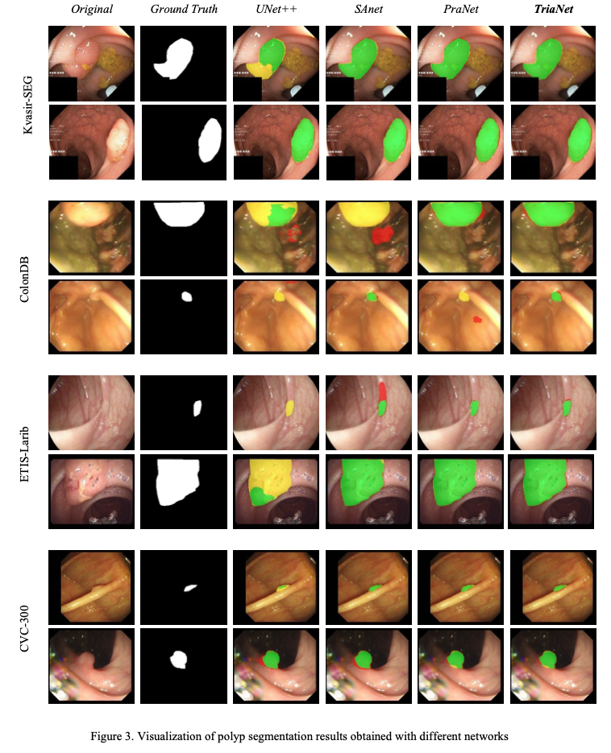
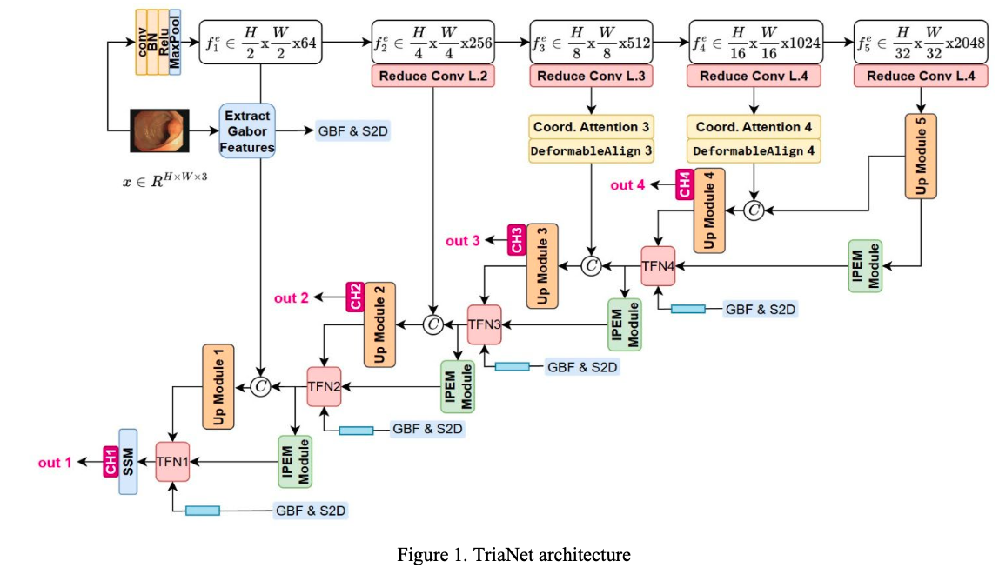

# TriaNet: A Tri-Fusion Attention Network for Segmenting Polyps with Ambiguous Boundaries







## Overview

You can access the images, model files (pth), and training/testing data at the following link:
[Google Drive Link](https://drive.google.com/drive/folders/1WHxOhgtM9sKdilZue9wrzeboyWt5hqmI?usp=sharing)

Images for the compared methods can also be found in the Drive link above.

## Compared Methods
The following methods were used for comparison:
- CaraNet
- MSNET
- PRANET
- SANET
- SFA
- UNET
- UNET++

## Usage

### Generating Images
You can generate the output images by running the `test.py` script.
```bash
python test.py
```

### Getting Metrics
You can obtain the metric results by running the `take_results.py` script.
```bash
python take_results.py
```

## Citation
If you use this work in your research, please cite our paper.
